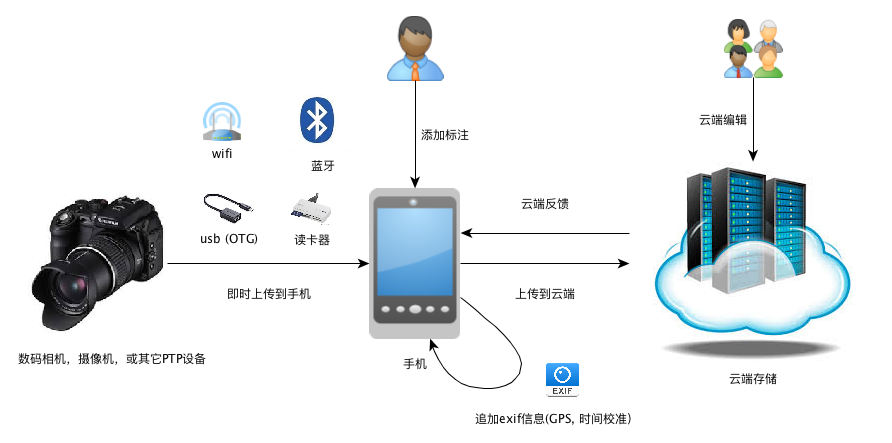

# Instant Upload 数码相机即时上传api

## 什么是即时即时上传api

即时上传api可以通过让手机通过USB (android OTG方式) 数据线连接数码相机设备，在数码相机有新增文件操作的时候，即时上传内容到手机中(usb host)

对于协议的情况，请参考

[说明文档](README.md)

## 一些调研主题

- [为家用单反服务](docs/For_Personal_Camera.md)
- [简单适配度高](docs/Simple_and_High_Adaptation.md)
- 爱云动的业务封装
- 后端的存储，云盘等...
- 业务场景，双向打通
- [数据采集，地理信息的同步](docs/Geo.md)
- [传输方式不限于USB线](docs/OtherTransport.md)
- 相机的特殊操作
- [在照片上加语音，加信息](docs/AddVoiceAndText.md)
- 爱运动App和摄端App的整合
- [如何让苹果iOS连接相机](docs/iOSSupport.md)
